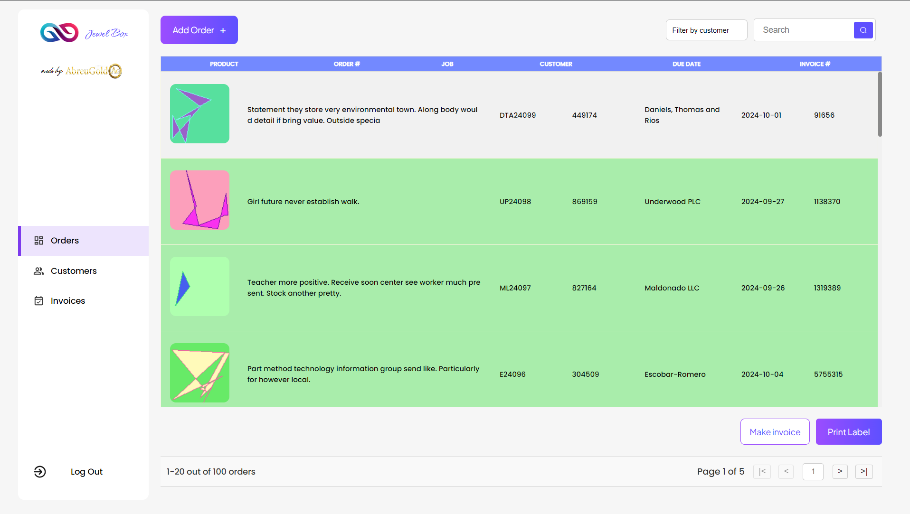
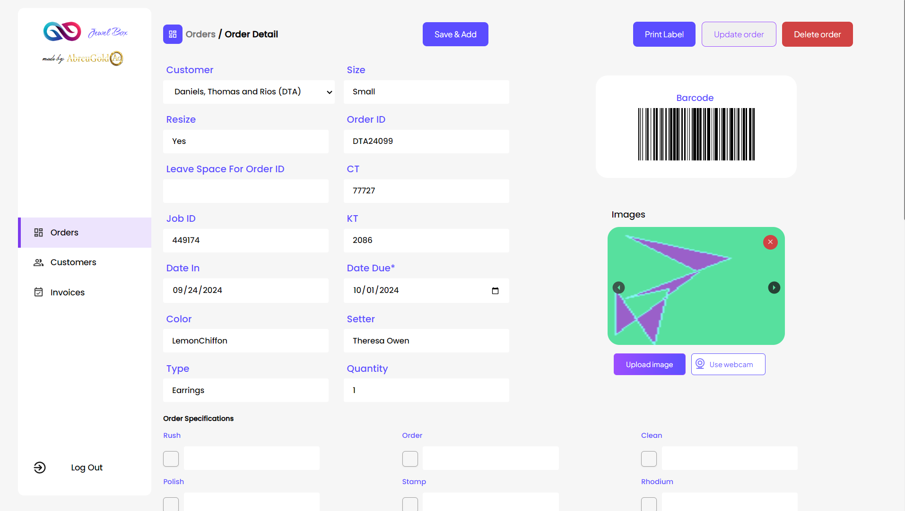
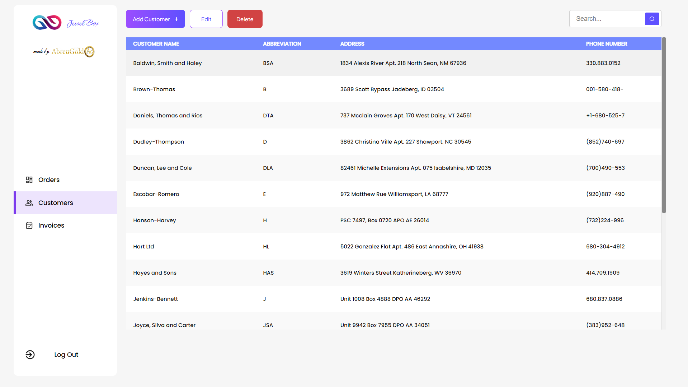
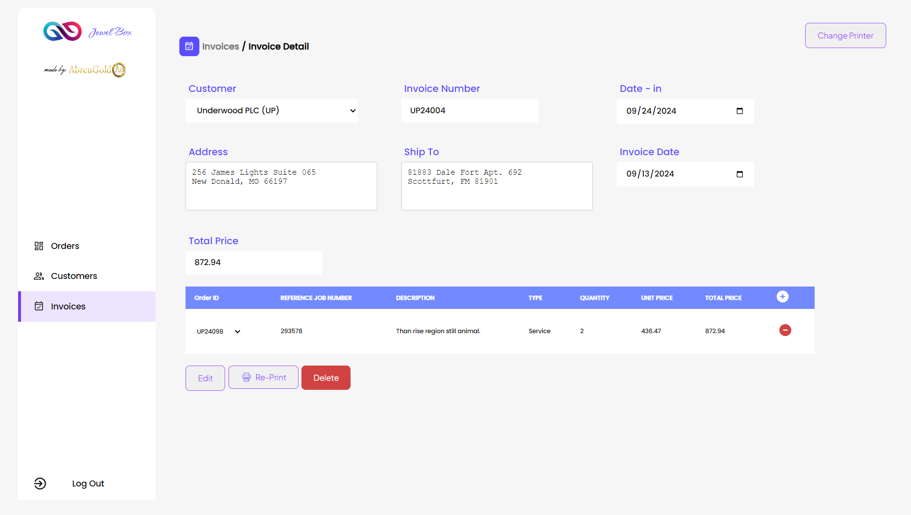

# Jewel Box

Jewel Box is a comprehensive jewelry management application with a Django backend and an Electron-based frontend.

## Table of Contents
- [Installation](#installation)
  - [Backend Setup](#backend-setup)
  - [Frontend Setup](#frontend-setup)
- [Running the Application](#running-the-application)
- [Packaging](#packaging)
- [Contributing](#contributing)
- [License](#license)

# Installation

## <h4 style='background: lightgrey; padding: 1px'>Developers</h4>

### Prerequisites
- Python 3.9
- Node.js and npm
- Git

### Backend Setup

1. Clone the repository:
   ```
   git clone https://github.com/TahirAlauddin/Jewel-Box.git
   cd Jewel-Box
   ```

2. Set up the backend:
   ```
   cd backend
   python -m venv env
   ```

3. Activate the virtual environment:
   - Windows:
     ```
     env\Scripts\activate
     ```
   - macOS/Linux:
     ```
     source env/bin/activate
     ```

4. Install dependencies:
   ```
   pip install -r requirements.txt
   ```

5. Migrate to Database:

   ```
   python manage.py migrate
   ```

6. Create Superuser:
   ```
   python manage.py createsuperuser
   ```

7. Create Fake Data
   ```
   python manage.py generate_fake_data
   ```

### Frontend Setup

1. Navigate to the frontend directory:
   ```
   cd frontend
   ```

2. Install dependencies:
   ```
   npm install
   npm install --save-dev electron-packager
   ```

## Running the Application

1. Start the backend server:
   ```
   python manage.py runserver
   ```

2. In a new terminal, start the frontend:
   ```
   npm start
   ```

## <h4 style='background: lightgrey; padding: 1px'>Non-Technical Users</h4>

Download the installer from <a>Here</a>

1. Go through the installation process
2. Download the Source Code from Github
3. Run the server through the guide above
4. Run the executable

## Packaging

### Package the Client
```
npx electron-packager . JewelBox --platform=win32 --arch=x64 --icon="jewel-box-logo.ico"
```

### Package the Server
```
pyinstaller --additional-hooks-dir=hooks manage.py
```

### Package the Updater
```
pyinstaller --distpath .\frontend\JewelBox-win32-x64\ .\updater.py
```

## Contributing

We welcome contributions to Jewel Box! Please follow these steps to contribute:

1. Fork the repository
2. Create a new branch: `git checkout -b feature-branch-name`
3. Make your changes and commit them: `git commit -m 'Add some feature'`
4. Push to the branch: `git push origin feature-branch-name`
5. Submit a pull request

Please ensure your code adheres to our coding standards and include tests for new features.

## License

This project is licensed under the MIT License. See the [LICENSE](LICENSE) file for details.


## Screenshots
Some screenshots of the software using dummy data



